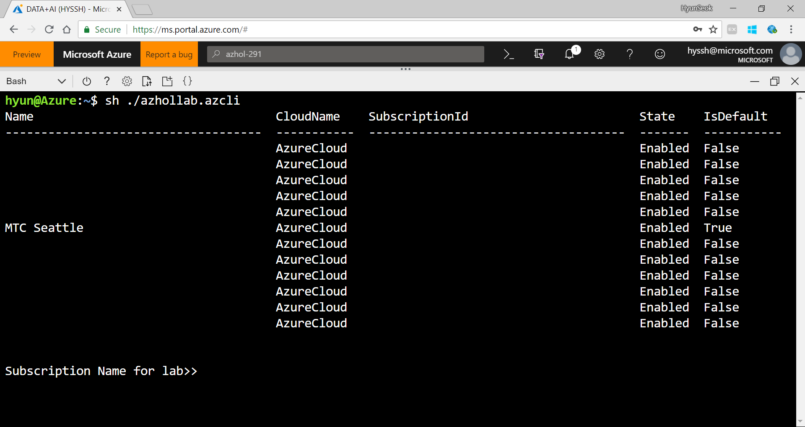

# Cloud Scale Advanced Analtyics

Experience end-to-end Advanced Analytics on cloud using Blob, ADF, Databricks, SQLDB/DW and Azure Machine Leaning Studio.

Thu out this hands on lab Understand how to apply followings for you work:

* Azure Data Factory
* Azure Databricks
* Azure SQL Database
* Azure ML Studio
* Azure Key Vault

After the workshop you will be able to:

1. Understand process and architecture for cloud scale andvanced analaytics project
1. Create appropreate Azure services for data prep. & training environment
1. Know how to wanggle data in a scale
1. Expermiments on data and select  
1. Deploy and interact with score model

## Briefing

Overview and intro about Azure Data Services
Focus on data preparation and machine learning experiments
demo
	* Databricks and ML Studio

## Hands on lab
Architecture and scenario

## Architecture

## Scenario

### [Lab 00 Create hands on lab environment](https://github.com/xlegend1024/az-cloudscale-adv-analytics/blob/master/00.SetupEnv.md)

1. Open browser and go to [Azure Portal](https://portal.azure.com)

1. Open cloud shell from the browser

1. Download a script

1. Run command to create a resource group and resource

> Care with subscription name when you run the script

Make sure you use correct __Azure Subscription__ for the Hands-on lab.

1. Make sure you have a resource group and Azure Key Vault, Blob, SQLDB in the resource group
	
### [Lab 01 Ingest](https://github.com/xlegend1024/az-cloudscale-adv-analytics/blob/master/01Ingest.md)

1. Create Azure Data Factory (v2)

1. Create Data Pipeline

### [Lab 02 Data wrangling](https://github.com/xlegend1024/az-cloudscale-adv-analytics/blob/master/02DataWrangling.md)

1. Create Azure Databricks

1. Create Azure Databricks cluster

1. Import Notebook

	1. Import from  https://raw.githubusercontent.com/xlegend1024/az-cloudscale-adv-analytics/master/AzureDatabricks/02.datawrangling.ipynb

	1. Update widget parameters

	1. Run command from the notebook
	
		* Run differen languages (Python, Scala, R, SQL) to load data from blob to databricks
		* Data wrangling
		* Save final training dataset to blob

### [Lab 03. Modeling](https://github.com/xlegend1024/az-cloudscale-adv-analytics/blob/master/03Modeling.md)

1. Create Azure Machine Learning Studio

1. Create workspace

Access the training dataset and import into Azure ML Studio.

### [Lab 04. Operationalize score model](https://github.com/xlegend1024/az-cloudscale-adv-analytics/blob/master/04Operationalization.md)

	(Demo) Azure ML operationalization
	Create web service
	Update inputs
	Publish web service
	Download a sample excel and test   

### [Lab 05. Run](https://github.com/xlegend1024/az-cloudscale-adv-analytics/blob/master/05RunMLBatch.md)

	(Demo) ADF and ML
	Create a new pipeline for batch ml processing
	

---
[Next > 01. Ingest Data](https://github.com/xlegend1024/az-cloudscale-adv-analytics/blob/master/01Ingest.md)

---

[Next > 02. Data Wrangling](https://github.com/xlegend1024/az-cloudscale-adv-analytics/blob/master/02DataWrangling.md)

---

## Sources and references
* https://docs.microsoft.com/en-us/azure/machine-learning/studio/azure-ml-customer-churn-scenario